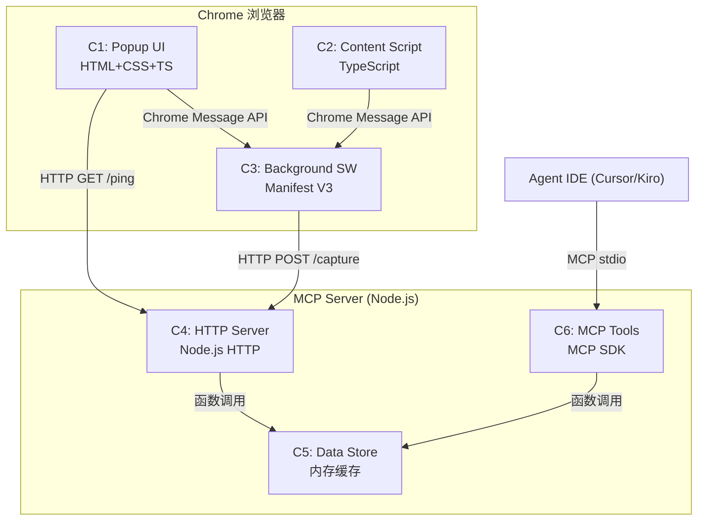
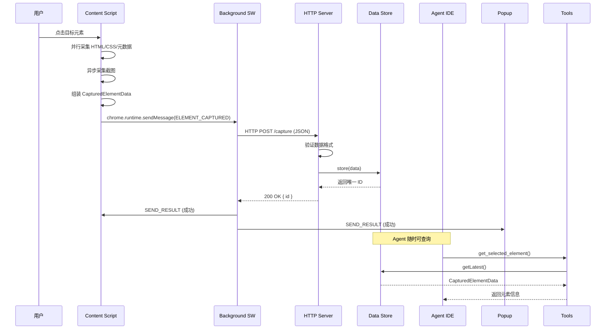

# 设计文档

## 概述

Chrome-Agent Bridge 是一个连接 Chrome 浏览器与 Agent IDE（如 Cursor/Kiro）的开发者工具。系统由两个独立进程组成：Chrome 扩展（负责元素选择与信息采集）和本地 MCP Server（负责数据接收、缓存与 MCP 协议暴露）。两者通过 HTTP 通信，MCP Server 通过 stdio 与 Agent IDE 交互。

核心数据流：用户在浏览器中选中元素 → Content Script 采集 HTML/CSS/截图 → Background SW 通过 HTTP POST 发送到 MCP Server → Data Store 缓存 → Agent IDE 通过 MCP 工具查询。

### 设计决策

- **无框架 HTTP Server**: 使用 Node.js 原生 `http` 模块，避免引入 Express 等框架，保持轻量（内存 < 50MB）
- **内存缓存而非持久化**: Data Store 使用纯内存存储，进程退出即清空，符合临时采集场景
- **Manifest V3**: 遵循 Chrome 最新扩展规范，使用 Service Worker 替代 Background Page
- **Monorepo 共享类型**: Chrome 扩展和 MCP Server 共享 TypeScript 类型定义，确保数据结构一致性

## 架构

### 系统架构图



### 数据流序列图



## 组件与接口

### C1: Popup UI

- **职责**: 用户控制界面，展示 MCP Server 连接状态，激活/停用元素选择器
- **技术**: HTML + CSS + TypeScript（Chrome Extension Popup）
- **生命周期**: 用户点击扩展图标时创建，关闭时销毁

| 方法 | 签名 | 说明 |
|------|------|------|
| `checkServerStatus` | `() => Promise<boolean>` | HTTP GET /ping 检查 MCP Server 在线状态 |
| `toggleSelector` | `() => void` | 发送 ACTIVATE/DEACTIVATE_SELECTOR 消息给 Background SW |
| `renderStatus` | `(online: boolean) => void` | 更新 UI 连接状态指示器（绿色/灰色） |

### C2: Content Script

- **职责**: 注入目标网页，负责元素选择器交互和信息采集
- **技术**: TypeScript，运行在网页上下文
- **生命周期**: 由 Background SW 按需注入（`chrome.scripting.executeScript`）

| 方法 | 签名 | 说明 |
|------|------|------|
| `activateSelector` | `() => void` | 启动选择器模式，绑定 mouseover/click 事件 |
| `deactivateSelector` | `() => void` | 停用选择器，移除事件监听和高亮 |
| `highlightElement` | `(el: Element) => void` | 为悬停元素添加高亮边框（outline overlay） |
| `captureElement` | `(el: Element) => Promise<CapturedElementData>` | 编排完整采集流程 |
| `captureScreenshot` | `(el: Element) => Promise<string>` | 元素区域截图，返回 Base64 PNG |
| `getComputedStyles` | `(el: Element) => Record<string, string>` | 获取计算后 CSS 样式 |
| `getMatchedCSSRules` | `(el: Element) => CSSRuleInfo[]` | 获取匹配的 CSS 规则（含媒体查询） |
| `getElementMetadata` | `(el: Element) => ElementMetadata` | 获取 DOM 路径、class、id、属性等 |

### C3: Background Service Worker

- **职责**: 扩展核心协调者，管理状态，消息路由，数据转发
- **技术**: TypeScript（Manifest V3 Service Worker）
- **生命周期**: Chrome 管理，事件驱动

| 方法 | 签名 | 说明 |
|------|------|------|
| `handleMessage` | `(msg: ExtMessage) => void` | 统一消息路由 |
| `sendToServer` | `(data: CapturedElementData) => Promise<SendResult>` | HTTP POST 到 MCP Server |
| `injectContentScript` | `(tabId: number) => Promise<void>` | 按需注入 Content Script |
| `updateBadge` | `(status: string) => void` | 更新扩展图标 badge |

### C4: HTTP Server

- **职责**: 监听 localhost:19816，接收并验证采集数据，转存 Data Store
- **技术**: Node.js 原生 `http` 模块（无框架）
- **生命周期**: 随 MCP Server 进程启动/停止

| 方法 | 签名 | 说明 |
|------|------|------|
| `start` | `(port: number) => Promise<void>` | 启动 HTTP 监听，绑定 localhost |
| `handleCapture` | `(req: CaptureRequest) => CaptureResponse` | 处理 POST /capture，验证并存储 |
| `handlePing` | `() => PingResponse` | 处理 GET /ping 健康检查 |

### C5: Data Store

- **职责**: 内存缓存采集数据，支持 ID 查询、最新查询、列表查询，容量上限 20 条
- **技术**: TypeScript Map + Array，纯内存
- **生命周期**: 随进程存在，退出即清空

| 方法 | 签名 | 说明 |
|------|------|------|
| `store` | `(data: CapturedElementData) => string` | 存储数据，生成唯一 ID，超 20 条淘汰最旧 |
| `getLatest` | `() => CapturedElementData \| null` | 获取最近一条记录 |
| `getById` | `(id: string) => CapturedElementData \| null` | 按 ID 查询 |
| `list` | `() => CapturedElementSummary[]` | 列出所有缓存摘要 |
| `clear` | `() => void` | 清空缓存 |

### C6: MCP Tools

- **职责**: 通过 MCP 协议向 Agent IDE 暴露工具接口
- **技术**: @modelcontextprotocol/sdk
- **生命周期**: 随 MCP Server 进程，由 Agent IDE 通过 stdio 管理

| 工具名 | 参数 | 返回 | 说明 |
|--------|------|------|------|
| `get_selected_element` | `{ id?: string }` | `CapturedElementData` | 获取最近/指定 ID 的完整元素信息 |
| `get_element_screenshot` | `{ id?: string }` | `{ screenshot: string }` | 获取元素截图 Base64 PNG |
| `get_element_styles` | `{ id?: string }` | `{ styles: ... }` | 获取元素 CSS 样式详情 |
| `list_captured_elements` | 无 | `CapturedElementSummary[]` | 列出历史采集记录摘要 |

### 通信协议

**Chrome 扩展内部通信:**
- 方式: `chrome.runtime.sendMessage()` / `chrome.runtime.onMessage`
- 格式: `{ type: string, payload: any }`
- 消息类型:
  - `ACTIVATE_SELECTOR` — Popup → Background → Content Script
  - `DEACTIVATE_SELECTOR` — Popup → Background → Content Script
  - `ELEMENT_CAPTURED` — Content Script → Background
  - `SEND_RESULT` — Background → Content Script / Popup
  - `STATUS_REQUEST` — Popup → Background

**Chrome 扩展 → MCP Server:**
- 方式: HTTP POST `http://localhost:19816/capture`
- Content-Type: `application/json`
- 请求体: `CapturedElementData` JSON

**MCP Server → Agent IDE:**
- 方式: MCP Protocol over stdio
- 工具: `get_selected_element`, `get_element_screenshot`, `get_element_styles`, `list_captured_elements`

## 数据模型

### 核心数据结构

```typescript
// 采集的元素完整数据
interface CapturedElementData {
  id: string;                          // 唯一标识符 (UUID v4)
  timestamp: number;                   // 采集时间戳 (Unix ms)
  url: string;                         // 来源页面 URL
  title: string;                       // 来源页面标题
  element: {
    tagName: string;                   // 元素标签名
    html: string;                      // outerHTML（含子元素）
    text: string;                      // textContent
    classes: string[];                 // class 列表
    id: string | null;                 // 元素 ID
    attributes: Record<string, string>; // 所有属性键值对
    domPath: string;                   // DOM 路径，如 "body > div.app > main"
  };
  styles: {
    computed: Record<string, string>;  // 计算后 CSS 样式
    matched: CSSRuleInfo[];            // 匹配的 CSS 规则
  };
  screenshot: string | null;           // Base64 PNG 截图
}

// CSS 规则信息
interface CSSRuleInfo {
  selector: string;                    // CSS 选择器
  properties: Record<string, string>;  // CSS 属性键值对
  mediaQuery: string | null;           // 媒体查询条件
  source: string;                      // 样式来源（stylesheet URL 或 "inline"）
}

// 采集记录摘要（用于列表展示）
interface CapturedElementSummary {
  id: string;
  timestamp: number;
  url: string;
  tagName: string;
  classes: string[];
  text: string;                        // 截断的 textContent
}
```

### Chrome 扩展消息类型

```typescript
// 扩展内部消息格式
type ExtMessage =
  | { type: 'ACTIVATE_SELECTOR' }
  | { type: 'DEACTIVATE_SELECTOR' }
  | { type: 'ELEMENT_CAPTURED'; payload: CapturedElementData }
  | { type: 'SEND_RESULT'; payload: { success: boolean; id?: string; error?: string } }
  | { type: 'STATUS_REQUEST' };
```

### HTTP 接口数据模型

```typescript
// POST /capture 请求体
type CaptureRequest = CapturedElementData;

// POST /capture 成功响应
interface CaptureResponse {
  success: true;
  id: string;
}

// POST /capture 失败响应
interface CaptureErrorResponse {
  success: false;
  error: string;
}

// GET /ping 响应
interface PingResponse {
  status: 'ok';
  timestamp: number;
}
```

### Data Store 内部结构

```typescript
class DataStore {
  private items: Map<string, CapturedElementData>;  // ID → 完整数据
  private order: string[];                           // 按时间排序的 ID 列表
  private readonly MAX_CAPACITY = 20;                // 最大缓存容量
}
```


## 正确性属性

*属性（Property）是指在系统所有合法执行中都应成立的特征或行为——本质上是对系统应做什么的形式化陈述。属性是人类可读规格说明与机器可验证正确性保证之间的桥梁。*

### 属性 1: 选择器模式 Toggle 往返一致性

*对于任意* Content Script 实例，激活选择器模式后再停用，应恢复到初始状态（无事件监听、无高亮效果），且选择器状态标志为 false。

**验证需求: 1.1, 1.3**

### 属性 2: 元素采集数据完整性

*对于任意* CapturedElementData 对象，其 `element` 字段必须包含所有必需属性（tagName、html、text、classes、id、attributes、domPath），且 `styles` 字段必须包含 computed 和 matched 子字段。

**验证需求: 2.4, 2.5**

### 属性 3: Data Store 存储/查询往返一致性

*对于任意* 合法的 CapturedElementData，调用 `store(data)` 返回的 ID 用于 `getById(id)` 查询时，应返回与原始数据等价的对象。

**验证需求: 5.1, 5.3**

### 属性 4: Data Store 容量不变量

*对于任意* 数量的连续 `store()` 操作，Data Store 中的记录数应始终不超过 20 条（MAX_CAPACITY），且当超出容量时被淘汰的应是最早存入的记录。

**验证需求: 5.2**

### 属性 5: Data Store getLatest 正确性

*对于任意* 非空的存储操作序列，`getLatest()` 应返回最后一次 `store()` 存入的记录。

**验证需求: 5.4**

### 属性 6: Data Store 列表摘要一致性

*对于任意* Data Store 状态，`list()` 返回的摘要数量应等于当前缓存记录数，且每条摘要的 id、timestamp、url、tagName、classes 字段应与对应完整记录一致。

**验证需求: 5.5, 6.5**

### 属性 7: HTTP /capture 数据验证正确性

*对于任意* 符合 CapturedElementData 结构的 JSON 请求体，`handleCapture` 应返回 HTTP 200 并包含有效 ID；*对于任意* 不符合结构的请求体，应返回 HTTP 400。

**验证需求: 4.2, 4.3**

### 属性 8: HTTP 响应 CORS 头不变量

*对于任意* HTTP Server 返回的响应，响应头中应包含正确的 CORS 头（Access-Control-Allow-Origin），允许 Chrome 扩展的跨域请求。

**验证需求: 4.6**

### 属性 9: MCP 工具数据一致性

*对于任意* 存储在 Data Store 中的 CapturedElementData，通过 `get_selected_element` 获取的完整数据、通过 `get_element_screenshot` 获取的截图、通过 `get_element_styles` 获取的样式，应分别与 Data Store 中对应记录的相应字段一致。

**验证需求: 6.2, 6.3, 6.4**

### 属性 10: CapturedElementData JSON 序列化往返一致性

*对于任意* 合法的 CapturedElementData 对象，将其序列化为 JSON 字符串后再反序列化，应产生与原始对象深度相等的结果。

**验证需求: 11.1, 11.2, 11.3**

### 属性 11: 发送结果通知一致性

*对于任意* `sendToServer` 调用，当 HTTP POST 成功时应产生 `{ success: true, id: string }` 的 SEND_RESULT 消息；当失败时应产生 `{ success: false, error: string }` 的 SEND_RESULT 消息。

**验证需求: 3.1, 3.2, 3.3, 3.4**

## 错误处理

### Chrome 扩展侧

| 错误场景 | 处理策略 |
|----------|----------|
| Content Script 注入失败 | Background SW 捕获异常，通知 Popup UI 显示错误提示 |
| 元素采集超时（>500ms） | 截图采集设置超时，超时后 screenshot 字段设为 null，其余数据正常发送 |
| Chrome Extension Message 发送失败 | Content Script 在页面上显示错误提示 |
| HTTP POST 发送失败（网络错误） | Background SW 通知 Content Script 和 Popup UI 显示失败原因 |
| MCP Server 离线 | Popup UI 显示灰色离线状态，用户仍可操作但数据无法发送 |

### MCP Server 侧

| 错误场景 | 处理策略 |
|----------|----------|
| POST /capture 请求体 JSON 解析失败 | 返回 HTTP 400，包含 "Invalid JSON" 错误信息 |
| POST /capture 数据格式验证失败 | 返回 HTTP 400，包含具体字段验证错误信息 |
| Data Store 存储异常 | 返回 HTTP 500，记录错误日志 |
| MCP 工具调用时无数据 | 返回描述性提示："当前无已采集的元素数据，请先在浏览器中选择元素" |
| MCP 工具调用时指定 ID 不存在 | 返回提示："未找到 ID 为 {id} 的元素数据" |
| HTTP Server 端口被占用 | 启动时抛出错误，进程退出并输出端口冲突提示 |

### 通用错误处理原则

- 所有异步操作使用 try/catch 包裹
- 错误信息应具有描述性，帮助开发者定位问题
- Chrome 扩展侧错误不应导致页面崩溃
- MCP Server 侧错误不应导致进程退出（端口冲突除外）

## 测试策略

### 双重测试方法

本项目采用单元测试 + 属性测试的双重策略，确保全面覆盖。

### 属性测试（Property-Based Testing）

**测试库**: [fast-check](https://github.com/dubzzz/fast-check)（TypeScript 生态最成熟的属性测试库）

**配置要求**:
- 每个属性测试最少运行 100 次迭代
- 每个测试必须通过注释引用设计文档中的属性编号
- 标签格式: `Feature: chrome-agent-bridge, Property {N}: {属性描述}`

**属性测试覆盖**:

| 属性 | 测试目标 | 生成器策略 |
|------|----------|-----------|
| 属性 1 | 选择器 toggle 往返 | 生成随机初始状态序列 |
| 属性 2 | 采集数据完整性 | 生成随机 CapturedElementData 对象 |
| 属性 3 | store/getById 往返 | 生成随机 CapturedElementData |
| 属性 4 | 容量不变量 | 生成 1-50 条随机数据的存储序列 |
| 属性 5 | getLatest 正确性 | 生成随机长度的存储序列 |
| 属性 6 | list 摘要一致性 | 生成随机 Data Store 状态 |
| 属性 7 | /capture 验证 | 生成合法和非法的 JSON 请求体 |
| 属性 8 | CORS 头不变量 | 生成随机 HTTP 请求 |
| 属性 9 | MCP 工具数据一致性 | 生成随机 Data Store 状态后调用工具 |
| 属性 10 | JSON 序列化往返 | 生成随机 CapturedElementData |
| 属性 11 | 发送结果通知 | 生成随机成功/失败场景 |

**每个属性由单个属性测试实现**，通过 fast-check 的 `fc.assert(fc.property(...))` 执行。

### 单元测试

**测试框架**: Vitest

**单元测试覆盖**:

| 模块 | 测试重点 |
|------|----------|
| Data Store | 空 store 查询返回 null、clear 后记录为空 |
| HTTP Server | GET /ping 返回 200、端口绑定 localhost |
| MCP Tools | 无数据时返回提示信息、指定不存在 ID 的错误处理 |
| Background SW | Content Script 未注入时触发注入逻辑 |
| 数据验证 | 缺少必需字段的请求体被拒绝、空对象被拒绝 |

### 测试组织

```
packages/
  shared/
    src/__tests__/
      serialization.property.test.ts    # 属性 10
      types.test.ts                     # 类型完整性
  mcp-server/
    src/__tests__/
      data-store.property.test.ts       # 属性 3, 4, 5, 6
      data-store.test.ts                # 边界情况
      http-server.property.test.ts      # 属性 7, 8
      http-server.test.ts               # ping、端口绑定
      mcp-tools.property.test.ts        # 属性 9
      mcp-tools.test.ts                 # 无数据提示
  chrome-extension/
    src/__tests__/
      selector.property.test.ts         # 属性 1
      capture.property.test.ts          # 属性 2
      transport.property.test.ts        # 属性 11
```
