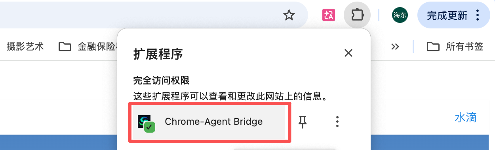
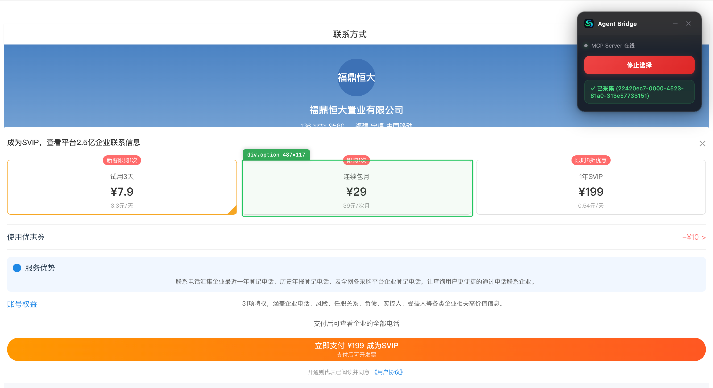
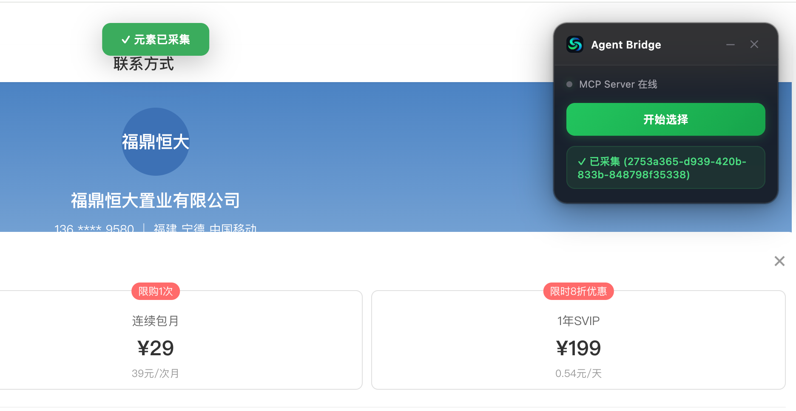
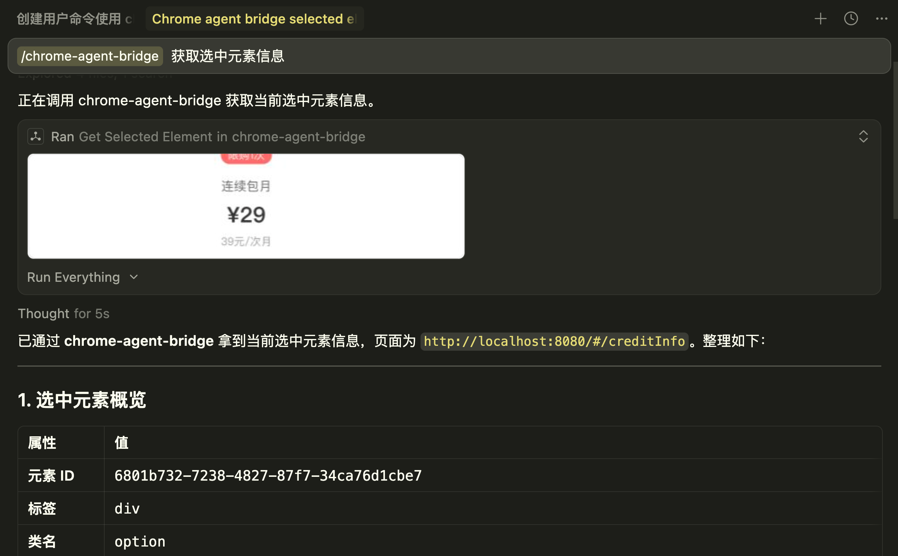
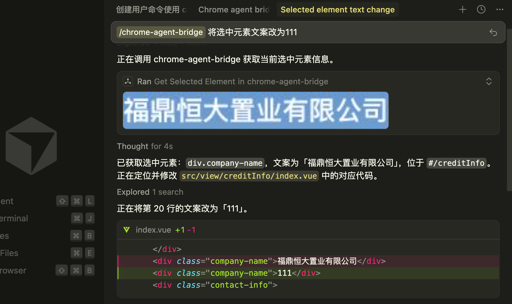
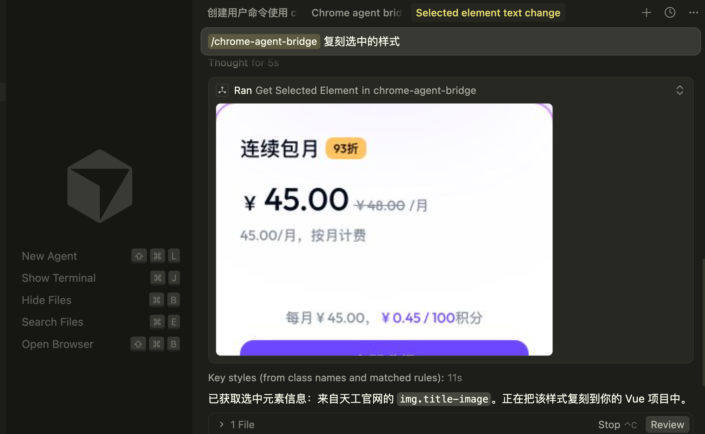
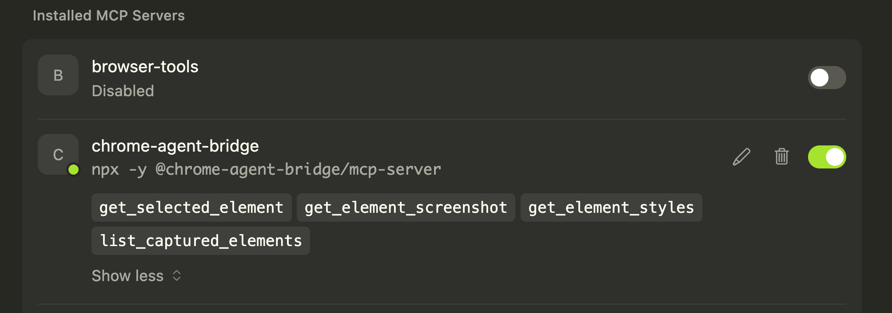

<p align="center">
  
</p>

<h1 align="center">Chrome-Agent Bridge</h1>

<p align="center">
  <strong>打通 Chrome 浏览器与 AI Agent IDE 的桥梁 — 点击网页元素，AI 助手直接获取完整信息。</strong>
</p>

<p align="center">
  <a href="#为什么需要它">为什么需要</a> •
  <a href="#普通用户快速上手">普通用户</a> •
  <a href="#开发者指南">开发者</a> •
  <a href="#mcp-工具参考">MCP 工具</a> •
  <a href="#常见问题">FAQ</a>
</p>

<p align="center">
  
  
  
  
</p>

---

## 为什么需要它？

使用 AI 编程助手（Cursor、Kiro 等）时，浏览器和 IDE 之间存在明显的断层：

- **"照这个做"** — 看到一个漂亮的网页组件，需要手动复制 HTML/CSS 粘贴到聊天窗口，信息丢失、上下文不完整。
- **"修这个样式"** — 在浏览器发现样式问题，要打开 DevTools → 复制选择器 → 切到 IDE → 搜索文件 → 再跟 AI 解释。

Chrome-Agent Bridge 消除了这个摩擦。**在浏览器中点击元素 → AI 助手立刻获得完整信息**：HTML 结构、所有 CSS 样式、截图和完整元数据。并且通过agent中大模型能力自动定位到项目代码位置；

## 使用示例
### 视频演示示例
<video controls src="docs/3月3日.mp4" title="Title"></video>

### 截图示例
1. 浏览器插件选中元素：打开插件点击-开始选择-选中对应元素-提示【元素已采集】




2. 获取选中元素信息


3. 修改选中的组件和元素


4. 复刻选中的其他网页样式


### 提示词示例
```
你:    /chrome-agent-bridge 将现在选中的样式修改为：111111
Agent: (自动调用 mcp 获取 HTML/CSS/截图)
       根据采集到的元素信息，自定定位当前代码文件位置，自动执行代码修改任务

你:    /chrome-agent-bridge 我喜欢这个网页上的卡片组件，帮我用 React + Tailwind 实现一个类似的。

Agent: (自动调用 mcp 获取 完整 HTML/CSS/截图)
       根据采集到的元素信息，这是一个带阴影的圆角卡片，以下是实现代码...
```

```
你:    /chrome-agent-bridge 帮我看看刚才选中的按钮用了哪些 CSS 样式

Agent: (自动调用 get_element_styles)
       这个按钮的主要样式包括 border-radius: 8px, background: linear-gradient(...)...
```

## 功能特性

- **点击即采集** — 鼠标悬停预览高亮，点击自动采集，无需打开 DevTools
- **自动截图** — 裁剪选中元素区域的截图
- **完整 CSS 提取** — 计算样式、匹配的 CSS 规则、媒体查询、样式来源
- **完整 HTML 和元数据** — outerHTML、DOM 路径、class、属性，一应俱全
- **MCP 协议集成** — 兼容所有支持 MCP 的 IDE（Cursor、Kiro 等）
- **零依赖 HTTP 服务** — 轻量 Node.js 原生实现，无框架依赖
- **仅限本地通信** — 所有数据在本机流转，不会发送到外部网络
- **纯内存存储** — 不写入磁盘，最多缓存 20 条记录，自动淘汰最旧数据

## 工作原理

```
┌─────────────────────────────────────────────────────────────┐
│                     Chrome 浏览器                            │
│                                                             │
│   点击元素 → Content Script 采集 HTML/CSS/截图/元数据         │
│                        ↓                                    │
│              Background Service Worker                      │
│                        ↓                                    │
└────────────────── HTTP POST ────────────────────────────────┘
                         ↓  localhost:19816
┌─────────────────────────────────────────────────────────────┐
│                    MCP Server (Node.js)                      │
│                                                             │
│   HTTP Server → 验证数据 → Data Store (内存缓存, 最多 20 条)  │
│                                  ↓                          │
│                            MCP Tools ──── stdio ──→ Agent IDE│
└─────────────────────────────────────────────────────────────┘
```

1. 在 Chrome 中点击元素 → 扩展自动采集 HTML、CSS、截图和元数据
2. 数据通过 HTTP POST 发送到本地 MCP Server
3. AI 助手通过 MCP 工具查询数据 — 全自动，无需复制粘贴

---

## 普通用户快速上手

> 不需要任何开发经验，按以下步骤操作即可使用。

### 前置条件

- **Node.js** >= 18（[下载地址](https://nodejs.org/)，选择 LTS 版本，安装后终端输入 `node -v` 验证）
- **Chrome** 浏览器（或 Edge、Brave 等 Chromium 内核浏览器）
- **Cursor** 或 **Kiro** 等支持 MCP 协议的 AI IDE

### 第一步：安装 Chrome 扩展

1. 从仓库根目录下载 [`chrome-extension-v0.1.0.zip`](https://github.com/HaiDong-Once/chrome-agent-bridge/blob/main/chrome-extension-v0.1.0.zip)
2. 解压到本地任意目录（如 `~/chrome-agent-bridge-extension/`）
3. 打开 Chrome，地址栏输入 `chrome://extensions/`
4. 开启右上角的 **「开发者模式」** 开关
5. 点击 **「加载已解压的扩展程序」**
6. 选择刚才解压的文件夹
7. 扩展图标出现在浏览器工具栏中 

> 后续版本将发布到 Chrome Web Store，届时可直接从商店安装，无需开发者模式。

> 如果使用 Edge 浏览器，访问 `edge://extensions/` 执行相同操作。

### 第二步：配置 MCP Server

MCP Server 由 IDE 自动管理，不需要手动启动。你只需要告诉 IDE 在哪里找到它。

提供两种方式，任选其一：

<details open>
<summary><strong>方式一：npx 远程加载（推荐，最简单）</strong></summary>

不需要下载任何文件，IDE 会自动从 npm 拉取并运行。

**Cursor** — 编辑 `~/.cursor/mcp.json`：

```json
{
  "mcpServers": {
    "chrome-agent-bridge": {
      "command": "npx",
      "args": ["-y", "@chrome-agent-bridge/mcp-server"]
    }
  }
}
```
配置成功示例：


**Kiro** — 编辑 `~/.kiro/settings/mcp.json`：

```json
{
  "mcpServers": {
    "chrome-agent-bridge": {
      "command": "npx",
      "args": ["-y", "@chrome-agent-bridge/mcp-server"],
      "disabled": false,
      "autoApprove": []
    }
  }
}
```

</details>

<details>
<summary><strong>方式二：下载到本地，使用本地路径</strong></summary>

1. 从仓库根目录下载 [`mcp-server-v0.1.5.zip`](https://github.com/HaiDong-Once/chrome-agent-bridge/blob/main/mcp-server-v0.1.5.zip)
2. 解压到本地任意目录（如 `~/chrome-agent-bridge-server/`）
3. 在解压目录中安装依赖：

```bash
cd ~/chrome-agent-bridge-server
npm install
```

4. 在 IDE 中配置 MCP：

**Cursor** — 编辑 `~/.cursor/mcp.json`：

```json
{
  "mcpServers": {
    "chrome-agent-bridge": {
      "command": "node",
      "args": ["/Users/你的用户名/chrome-agent-bridge-server/index.js"]
    }
  }
}
```

**Kiro** — 编辑 `~/.kiro/settings/mcp.json`：

```json
{
  "mcpServers": {
    "chrome-agent-bridge": {
      "command": "node",
      "args": ["/Users/你的用户名/chrome-agent-bridge-server/index.js"],
      "disabled": false,
      "autoApprove": []
    }
  }
}
```

> 将路径替换为你本机的实际解压路径。

</details>

### 第三步：开始使用

1. **确认连接** — 点击浏览器工具栏的扩展图标，查看状态指示器：
   - 绿色 = MCP Server 在线，可以使用
   - 灰色 = MCP Server 离线，请确认 IDE 已启动
2. **采集元素** — 点击「开始选择」→ 鼠标悬停元素会高亮 → 点击目标元素自动采集
3. **让 AI 使用** — 切到 IDE，直接告诉 AI 你想做什么，它会自动获取采集的数据

### 进阶：配置 Cursor Command 精准触发

在 Cursor 中，你可以配置一个自定义命令，确保 AI 每次都准确调用 Chrome-Agent Bridge 的 MCP 工具，而不需要你手动描述。

在项目根目录创建文件 `.cursor/commands/chrome-agent-bridge.md`：

```markdown
请调用 **chrome-agent-bridge** MCP 获取最新选中元素信息：

1. **当前选中信息**  
   - 元素的 HTML 结构
   - 样式（styles）
   - 截图（screenshot，base64）
根据获取的元素dom、样式定位代码位置；
根据获取的元素dom、样式、截图参考UI；

2. **若没有选中元素**  
   提示用户先去浏览器选中元素再操作

请直接执行上述步骤，无需再向我确认。
```

配置后，在 Cursor 聊天窗口输入 `/chrome-agent-bridge` 即可一键触发完整的采集 + 复刻流程。

> 你也可以在 Cursor 的 Rules 中添加类似的指令，让 AI 在特定场景下自动使用 Chrome-Agent Bridge。

---

## 开发者指南

> 适合想要参与开发、自行构建或二次开发的开发者。

### 前置条件

- **Node.js** >= 18
- **pnpm** >= 8
- **Chrome**（或 Chromium 内核浏览器）
- 支持 MCP 协议的 IDE（Cursor、Kiro 等）

### 克隆与构建

```bash
git clone https://github.com/HaiDong-Once/chrome-agent-bridge.git
cd chrome-agent-bridge
pnpm install
pnpm build
```

构建产物：

| 包 | 输出目录 | 说明 |
|----|---------|------|
| `@chrome-agent-bridge/shared` | `packages/shared/dist/` | 共享 TypeScript 类型定义 |
| `@chrome-agent-bridge/mcp-server` | `packages/mcp-server/dist/` | MCP Server 可执行文件 |
| `@chrome-agent-bridge/chrome-extension` | `packages/chrome-extension/dist/` | Chrome 扩展完整文件 |

### 安装 Chrome 扩展（本地构建版）

1. 打开 `chrome://extensions/`，开启开发者模式
2. 点击「加载已解压的扩展程序」
3. 选择 `packages/chrome-extension/dist/` 目录

> 代码修改后执行 `pnpm build`，然后在扩展页面点击刷新按钮即可更新。

### 配置 MCP Server（本地构建版）

使用构建产物的绝对路径配置 MCP：

<details open>
<summary><strong>Cursor</strong></summary>

编辑 `~/.cursor/mcp.json`（全局）或项目下 `.cursor/mcp.json`：

```json
{
  "mcpServers": {
    "chrome-agent-bridge": {
      "command": "node",
      "args": ["/Users/用户名/文稿/personalCode/chrome-agent-bridge/packages/mcp-server/dist/index.js"],
      "disabled": false,
      "autoApprove": []
    }
  }
}
```

</details>

<details>
<summary><strong>Kiro</strong></summary>

编辑 `~/.kiro/settings/mcp.json`（全局）或项目下 `.kiro/settings/mcp.json`：

```json
{
  "mcpServers": {
    "chrome-agent-bridge": {
      "command": "node",
      "args": ["/Users/用户名/文稿/personalCode/chrome-agent-bridge/packages/mcp-server/dist/index.js"],
      "disabled": false,
      "autoApprove": []
    }
  }
}
```

</details>

> 将路径替换为你本机项目的实际绝对路径。

### 配置 Cursor Command / Rules

为了让 Cursor 更精准地触发 Chrome-Agent Bridge，推荐配置自定义命令：

在项目根目录创建 `.cursor/commands/chrome-agent-bridge.md`：

```markdown
# 使用 Chrome Agent Bridge 复刻当前选中元素

请通过 **chrome-agent-bridge** MCP 完成以下流程：

1. **获取当前选中信息**
   - 元素的 HTML 结构
   - 样式（styles）
   - 截图（screenshot，base64）

2. **若没有选中元素**
   提示用户先去浏览器选中元素再操作

请直接执行上述步骤，无需再向我确认。
```

在 Cursor 聊天中输入 `/chrome-agent-bridge` 即可触发。

你也可以将类似内容写入 `.cursor/rules/` 或 `.cursorrules` 文件中，让 AI 在相关场景下自动使用该工具。

### 运行测试

```bash
# 运行所有测试（单元测试 + 属性测试）
pnpm test

# 监听模式（开发时使用）
pnpm test:watch

# 单独构建某个包
pnpm --filter @chrome-agent-bridge/shared build
pnpm --filter @chrome-agent-bridge/mcp-server build
pnpm --filter @chrome-agent-bridge/chrome-extension build
```

### 调试 MCP Server

脱离 IDE 单独运行 MCP Server：

```bash
node packages/mcp-server/dist/index.js
```

测试 HTTP 接口：

```bash
# 健康检查
curl http://localhost:19816/ping

# 发送测试数据
curl -X POST http://localhost:19816/capture \
  -H "Content-Type: application/json" \
  -d '{"url":"https://example.com","title":"Test","element":{"tagName":"div","html":"<div>test</div>","text":"test","classes":[],"id":null,"attributes":{},"domPath":"body > div"},"styles":{"computed":{},"matched":[]},"screenshot":null}'
```

### 项目结构

```
chrome-agent-bridge/
├── packages/
│   ├── shared/                  # 共享 TypeScript 类型定义
│   │   └── src/types.ts         # CapturedElementData, ExtMessage 等
│   ├── mcp-server/              # MCP Server（HTTP 接收 + MCP 协议暴露）
│   │   └── src/
│   │       ├── index.ts         # 入口 — 启动 HTTP + MCP 双服务
│   │       ├── http-server.ts   # HTTP 端点: /ping, /capture
│   │       ├── data-store.ts    # 内存缓存（最多 20 条）
│   │       ├── mcp-tools.ts     # MCP 工具定义
│   │       └── validator.ts     # 请求数据校验
│   └── chrome-extension/        # Chrome 扩展（Manifest V3）
│       └── src/
│           ├── content.ts       # 元素选择器、采集逻辑、浮动面板 UI
│           ├── background.ts    # Service Worker — 消息路由、HTTP 传输
│           └── popup.ts         # Popup UI — 状态检测、选择器开关
├── vitest.config.ts             # 测试配置
├── pnpm-workspace.yaml          # pnpm monorepo 配置
└── tsconfig.base.json           # TypeScript 基础配置
```

---

## MCP 工具参考

配置完成后，AI 助手可以使用以下工具：

| 工具 | 参数 | 说明 |
|------|------|------|
| `get_selected_element` | `id?`（可选） | 获取元素完整信息（HTML、CSS、元数据）+ 截图 |
| `get_element_screenshot` | `id?`（可选） | 获取元素截图（Base64 JPEG） |
| `get_element_styles` | `id?`（可选） | 获取 CSS 详情：计算样式 + 匹配规则及选择器 |
| `list_captured_elements` | — | 列出缓存中所有已采集元素的摘要 |

不传 `id` 时，默认返回最近一次采集的元素。

### 采集数据详情

| 数据类型 | 内容 |
|----------|------|
| HTML | 元素及子元素的完整 `outerHTML` |
| 计算样式 | 浏览器计算后的所有 CSS 属性值 |
| 匹配 CSS 规则 | 选择器、属性、媒体查询、样式表来源 |
| 截图 | 元素边界框的裁剪 JPEG 截图 |
| 元数据 | 标签名、class 列表、ID、所有属性、DOM 路径 |
| 页面上下文 | 来源页面 URL 和标题 |

---

## 常见问题

<details>
<summary><strong>扩展显示 "MCP Server 离线"？</strong></summary>

确认 IDE（Cursor/Kiro）已启动且 MCP 配置正确。MCP Server 由 IDE 自动管理，不需要手动启动。在 IDE 的 MCP 面板中检查 `chrome-agent-bridge` 的服务状态。
</details>

<details>
<summary><strong>端口 19816 被占用？</strong></summary>

查找并关闭占用端口的进程：

```bash
lsof -i :19816    # macOS/Linux
kill <PID>
```

然后重启 IDE。
</details>

<details>
<summary><strong>截图为空？</strong></summary>

部分受限页面（如 `chrome://` 系统页面）不支持截图 API。截图失败时，其他信息（HTML、CSS、元数据）仍会正常采集。
</details>

<details>
<summary><strong>数据会保存到磁盘吗？</strong></summary>

不会。所有数据仅存在于 MCP Server 进程内存中，进程退出即清空。缓存最多 20 条，超出自动淘汰最旧记录。
</details>

<details>
<summary><strong>支持哪些浏览器？</strong></summary>

所有 Chromium 内核浏览器：Chrome、Edge、Brave、Arc 等。要求 Chrome 116+（Manifest V3）。
</details>

<details>
<summary><strong>扩展需要哪些权限？</strong></summary>

遵循最小权限原则，仅需两个权限：
- `activeTab` — 访问当前活动标签页
- `scripting` — 向网页注入 Content Script
</details>

<details>
<summary><strong>npx 方式提示找不到包？</strong></summary>

确认已安装 Node.js >= 18，且网络可以访问 npm registry。可以先手动测试：

```bash
npx -y @chrome-agent-bridge/mcp-server --help
```

如果网络受限，请使用「下载到本地」的方式。
</details>

<details>
<summary><strong>如何更新？</strong></summary>

- **Chrome 扩展**：下载最新版本解压覆盖原目录，在 `chrome://extensions/` 点击刷新按钮
- **MCP Server（npx 方式）**：自动使用最新版本，无需操作
- **MCP Server（本地方式）**：下载最新版本覆盖原文件，重启 IDE
</details>

---

## 技术栈

- **TypeScript** — 全栈统一类型，跨包共享类型定义
- **MCP SDK** (`@modelcontextprotocol/sdk`) — Model Context Protocol 集成
- **Chrome Extension Manifest V3** — 现代扩展架构
- **Node.js 原生 `http`** — 零依赖 HTTP 服务
- **Vitest + fast-check** — 单元测试 + 属性测试
- **pnpm workspaces** — Monorepo 包管理

## 更新日志

### v0.1.6

**MCP Server — 多窗口共享支持**

- 支持多个 IDE 窗口同时连接：第一个窗口启动 HTTP Server，后续窗口自动进入客户端模式共享同一个 HTTP Server
- 修复 `killProcessOnPort` 误杀自身进程的问题：`lsof` 命令增加 `-sTCP:LISTEN` 过滤，并排除当前进程 PID
- 不再强制终止已有实例，避免新窗口启动导致旧窗口 MCP 断开

### v0.1.2

**MCP Server — 端口管理优化**

- 启动时自动检测端口占用，如果是旧的残留进程会自动终止并接管
- 注册 SIGTERM/SIGINT/SIGHUP 信号处理，进程退出时优雅释放端口
- 新增 `/data/latest`、`/data/id/:id`、`/data/list` 内部数据接口，支持客户端模式读取数据

**Chrome 扩展 — Bug 修复**

- 修复浮动面板状态指示器在线状态样式被 `checking` 状态覆盖的问题，绿色在线状态现在能正确显示

---

## License

MIT

## 关键词

Chrome Extension, MCP, Model Context Protocol, AI Agent, Cursor, Kiro, Web Scraping, DOM Capture, CSS Extraction, Browser Automation, Developer Tools, TypeScript, Node.js, Manifest V3, IDE Integration, AI Programming Assistant, Element Selector, Screenshot Capture, HTML Extraction, Style Inspector
